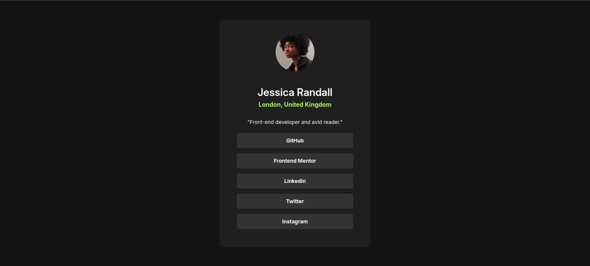

# Frontend Mentor - Social links profile solution

This is a solution to the [Social links profile challenge on Frontend Mentor](https://www.frontendmentor.io/challenges/social-links-profile-UG32l9m6dQ).  

## Table of contents

- [Overview](#overview) 
  - [Screenshot](#screenshot)
  - [Links](#links)
- [My process](#my-process)
  - [Built with](#built-with) 
- [Author](#author) 

## Overview 

### Screenshot

 

### Links

- Solution URL: [Github Repo](https://github.com/shad0w-max/social-links-profile)
- Live Site URL: [Live site](https://shad0w-max.github.io/social-links-profile/)

## My process

### Built with

- Semantic HTML5 markup 
- Flexbox
- CSS Grid  

## Author

- Frontend Mentor - [@shad0w-max](https://www.frontendmentor.io/profile/shad0w-max)
- X(Twitter) - [@0x_greatm3](https://x.com/0x_greatm3)
